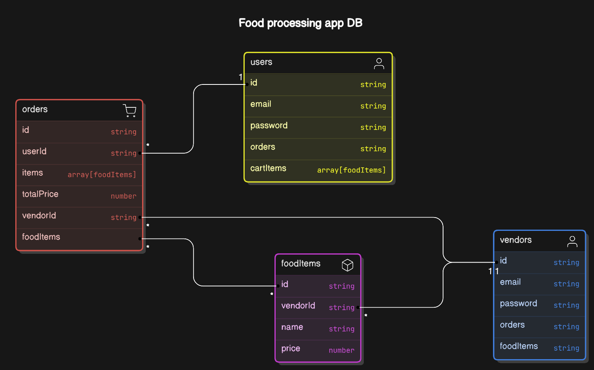

### Functional Requirements:
1. Vendor Management
  - A vendor can signup or signin.
  - A vendor can add/delete foodItems from their store.
  - A vendor can look at their orders.
  - A vendor can update the status of orders.

2. User Management
  - A user can signup or signin.
  - A user can add items to cart.
  - A user can proceed with cart items to place a order.

3. Order Notifications
  - When a order is placed, an immediate notification is sent to the vendor for whom order is placed.
  - When an order is updated by the vendor, an immediate notification should is sent to the user who placed the order.

### DB Models
1. User Model
  - name - string
  - email - string
  - password - string
  - roles - ['user', 'vendor']

2. FoodItem Model
  - name - string
  - description - string
  - price - number
  - category - [ "Appetizer", "Main Course", "Dessert", "Beverage", "Other", "Noodles", "Rolls" ]
  - imageUrl - string

3. Order Model
  - userId - string
  - items - [ {foodItemId, quantity}]
  - totalPrice - number
  - status - [ "pending", "confirmed", "preparing", "ready,"completed","cancelled"]